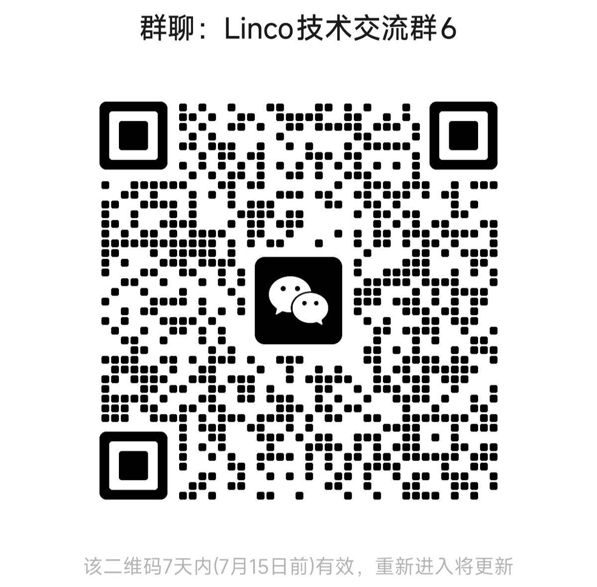

# 💬 Community

Linco Bridge is an open-source project, and we also maintain community channels for broader discussion around AI coding, frontier AI updates, Agent workflows, bridge integrations, and product-building practice.

For the Chinese version of this page, see [COMMUNITY.zh-CN.md](COMMUNITY.zh-CN.md).

## 👥 Technical Community

Join the WeChat technical group to discuss:

- AI coding skills, tools, and workflow practice
- frontier AI updates and notable industry signals
- open-source progress and release updates
- integration questions and bridge implementation details
- local Agent workflows, protocol design, and product ideas

Current WeChat group QR code:

Note: WeChat group QR codes may expire. If the QR code is no longer valid, please check the latest community information in this repository or in official Linco channels.

## 📰 Linco Lab

Follow **Linco Lab** for open-source updates, AI coding notes, bridge integration examples, Agent workflow content, and broader frontier AI observations.

- WeChat Official Account: `Linco Lab`
- Xiaohongshu: `Linco Lab`

## 📱 Linco App

For the full official product experience, see Linco App:

- iOS (TestFlight): [https://testflight.apple.com/join/Ahm1encB](https://testflight.apple.com/join/Ahm1encB)
- Android: [https://apphost.ddjf.info/](https://apphost.ddjf.info/)

## 🤝 Community Support

- The community group is a good place to ask integration questions, share usage feedback, and discuss AI coding, Agent workflows, and Linco-related practice.
- If you run into issues while using Linco Bridge, you are welcome to raise them in the community first. We will continue turning common questions into clearer repository documentation.
- If you discover a security vulnerability or another sensitive issue, please follow [SECURITY.md](SECURITY.md) or contact a group administrator for a private report.
