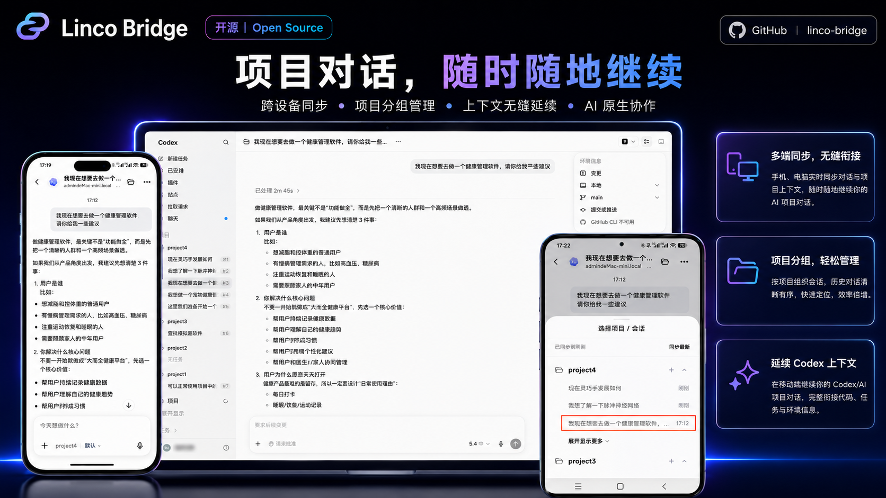
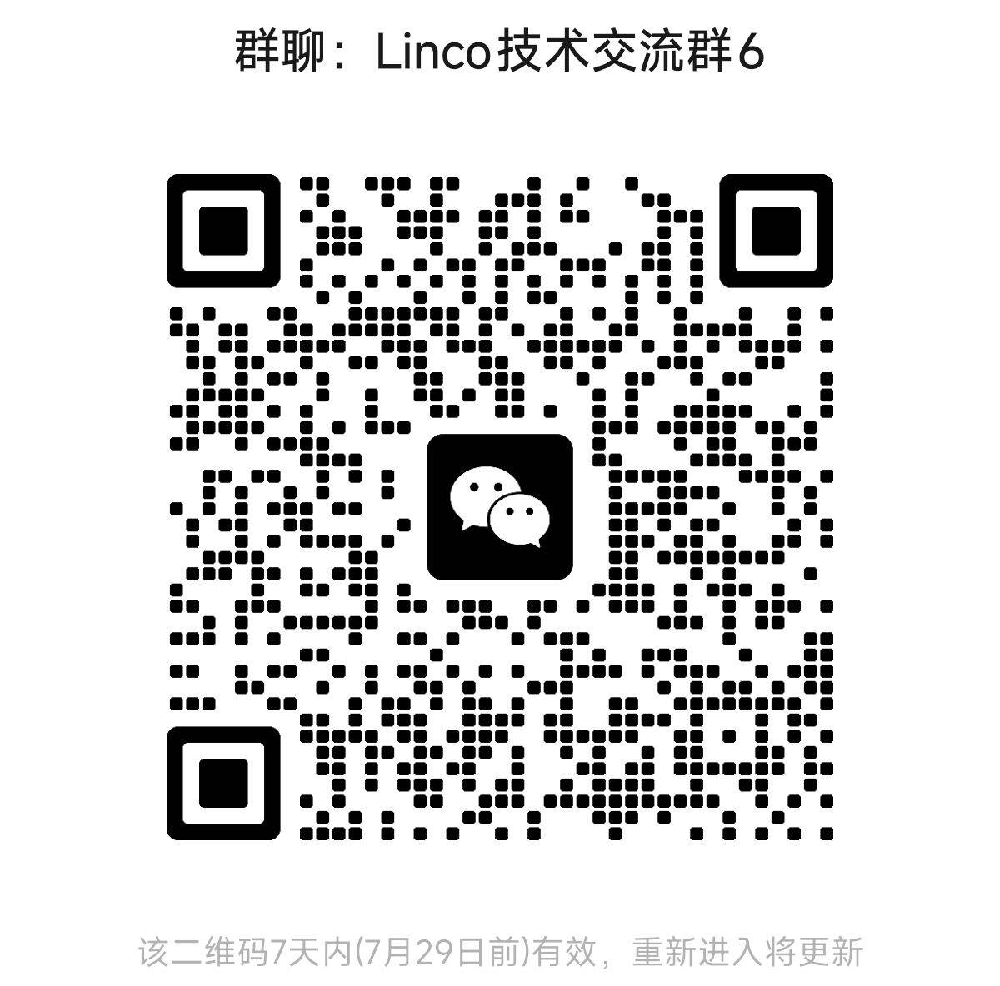

<p align="center">
  
</p>

<h1 align="center">Linco Bridge</h1>

<p align="center">
  An open bridge layer for connecting AI agent tools running on a personal computer
  to Web, H5, mini program, app, IM, or other clients.
</p>

<p align="center">
  <a href="README.zh-CN.md">简体中文</a>
  ·
  <a href="docs/quick-start.md">Quick Start</a>
  ·
  <a href="COMMUNITY.md">Community</a>
  ·
  <a href="CONTRIBUTING.md">Contributing</a>
</p>

<p align="center">
  
  
  
  
</p>

**Project status:** Open Source Alpha. Interfaces, compatibility, and documentation may still change. The first open-source release focuses on a working local connector, a deployable reference platform channel, and bridge validation for Codex CLI, Claude Code, Hermes, and OpenClaw.

<p align="center">
  <a href="https://testflight.apple.com/join/Ahm1encB">📱 iOS App</a>
  ·
  <a href="https://www.lincotalk.com/download/apk/linco.apk">🤖 Android App</a>
  ·
  <a href="https://bridge-demo.lincotalk.com">🌐 Hosted Demo</a>
  ·
  <a href="docs/media/linco-bridge-demo.mov">▶ Watch Demo</a>
  ·
  <a href="docs/quick-start.md">📘 Quick Start</a>
  ·
  <a href="COMMUNITY.md">💬 Community</a>
  ·
  <a href="README.zh-CN.md">🌐 简体中文</a>
</p>



## ✨ Highlights

| Local-first bridge | Better interaction model | Open extension surface |
| --- | --- | --- |
| Keep Agent CLIs running on the user's own computer while exposing sessions, attachments, and generated files to remote clients. | Avoid squeezing long-running Agent workflows into a generic IM UI by validating with a dedicated reference web/app flow. | Reuse the connector, protocol helpers, and channel adapter mechanism to build your own H5, mini program, app, web, or IM experience. |

## 🧭 Overview

Local AI agent tools are powerful, but their sessions, tool execution, and generated files usually stay on one computer. Many bridge projects connect these tools to existing collaboration platforms such as Feishu, WeChat, DingTalk, or similar IM products. That lowers integration cost, but display and interaction are constrained by the host platform: tool progress, permission confirmations, generated files, long-running sessions, multi-agent state, and session recovery are hard to present comfortably.

Linco Bridge is not meant to force every workflow into one IM product. It provides an open reference path:

- use the local connector plugin to bridge PC-based Agent CLIs;
- deploy the open reference platform to try the `linco-demo` channel quickly;
- use the official Linco channel for the full official product experience;
- build your own H5 page, mini program, app, web, or IM entry on top of the public protocol, SDKs, and channel adapter mechanism.

## 📦 Repository Scope

This repository contains two runnable subprojects plus project-level documentation:

- `linco-bridge-connect`: the local connector / plugin project. It runs on the user's computer, connects to local Agent CLIs, and relays messages, permission requests, attachments, and generated files to a remote channel;
- `linco-bridge-platform`: the open reference platform channel. It includes a NestJS backend and UniApp frontend for quickly self-hosting the `linco-demo` flow, and can be used as a reference for custom H5, mini program, or app development;
- `docs/`: project-level documentation for setup, architecture, protocol, security, support scope, and troubleshooting.

This repository does **not** include the full Linco App product or official hosted cloud-service code. The official Linco channel is a product experience entry; the open `linco-demo` channel is a deployable and customizable reference implementation.

## 🔄 Flow

```text
Local Agent CLI
    ↕ local process, gateway, or session files
linco-bridge-connect on the user's computer
    ↕ authenticated WebSocket bridge connection
Official Linco channel, open Reference Platform, or compatible backend
    ↕
Linco App, Reference Web, custom H5/mini program/app/IM client
```

`linco-bridge-connect` adapts the local agent and relays sessions, messages, permission requests, attachments, and generated files to compatible products. `linco-bridge-platform` provides a locally deployable backend and H5 experience for validating the full flow and for building a better custom interaction model.

## 🏗️ Architecture

| Layer | Role |
| --- | --- |
| `linco-bridge-connect` | Runs on the user's computer, talks to local Agent CLIs, and forwards messages, permissions, files, and session state. |
| Bridge backend / channel | Authenticates the device, maintains the bridge session, and exposes APIs or WebSocket endpoints to compatible clients. |
| Client surface | Can be the official Linco experience, the open reference platform, or a custom H5 / app / mini program / IM client. |

## 🚀 Recommended Paths

| Path | Best for | Notes |
| --- | --- | --- |
| Official product path (Linco App) | Users who want the official Linco experience with the lowest setup cost | Use Linco App together with the connector. The underlying official channel key is `linco`, but end users usually do not need to care about that term. |
| Open reference platform path (`linco-demo`) | Teams that want local validation, self-hosting evaluation, or implementation study | You can either run `linco-bridge-platform/server + web` locally, or use the official hosted demo entry. Both belong to the open reference-platform path. |
| Custom extension path | Product or engineering teams building their own interaction surface | Reuse the connector and Agent adapter layer, then add your own H5, mini program, app, web, or IM channel adapter. |

## ⚡ Quick Start

### Option 1: Official Product Path (Linco App)

The official product path is typically used together with Linco App:

- iOS (TestFlight): [https://testflight.apple.com/join/Ahm1encB](https://testflight.apple.com/join/Ahm1encB)
- Android: [https://www.lincotalk.com/download/apk/linco.apk](https://www.lincotalk.com/download/apk/linco.apk)

Install the local connector:

```bash
npm install -g linco-connect
```

Initialize it with credentials issued for the official product path:

```bash
linco-connect init \
  --token "<app-id>:<app-secret>" \
  --agent codex
```

Start the connector:

```bash
linco-connect start --daemon
```

Then open Linco App or another compatible official client, confirm the device is online, enter a session, and send a test message.

### Option 2: Open Reference Platform (Local Deployment)

Start the reference backend first:

```bash
cd linco-bridge-platform/server
npm install
npm run start:dev
```

Verify the backend:

```bash
curl http://127.0.0.1:3300/api/demo-config
```

Then start the H5 frontend:

```bash
cd linco-bridge-platform/web
npm install
npm run dev:h5
```

Open the local H5 URL printed by `npm run dev:h5`, then complete the bridge flow:

1. go to the **Bridge** tab;
2. click **Import from Codex**;
3. copy the generated `setupCommands`;
4. run the commands on the local machine;
5. return to the page and click `I have copied it, get connection status`;
6. wait for the page to confirm the connector is online;
7. click `Enter Codex` to enter the chat page;
8. use the folder icon in the top-right corner if you want to choose a project, open an existing session, or create a new session with `+`.

Use the page-generated `setupCommands` as the source of truth. A typical command shape looks like this for reference:

```bash
npm install -g linco-connect

linco-connect init \
  --token "demo-codex-app:demo-codex-secret" \
  --agent codex \
  --channel linco-demo \
  --account codex_1 \
  --allow-insecure-ws

linco-connect start --daemon
```

For the detailed flow, see [Quick Start](docs/quick-start.md), the [platform README](linco-bridge-platform/README.md), the [platform server README](linco-bridge-platform/server/README.md), and the [Web / H5 README](linco-bridge-platform/web/README.md).

### Option 3: Official Hosted Demo

This is the hosted entry of the open reference-platform path. It is suitable for users who want to try the bridge flow quickly without deploying `server + web` locally.

If you want to try Linco Bridge through the official hosted experience:

1. open [https://bridge-demo.lincotalk.com](https://bridge-demo.lincotalk.com); for the mini program, use the published search entry or QR code. The current mini-program flow uses **QR-code sign-in**;
2. open **Bridge** after entering the page;
3. click **Import from Codex**;
4. copy the generated `setupCommands`;
5. run those commands in a local terminal on your own computer;
6. return to the page and click **I have copied it, get connection status**;
7. wait until the page confirms the connector is online;
8. click **Enter Codex** to enter the chat page;
9. use the folder icon in the top-right corner if you want to choose a project, open an existing session, or create a new one;
10. send a test message to confirm the full bridge flow is working.

Mini-program experience QR code:


Note: the mini-program experience QR code may expire. Please use the latest image in this repository or the official published entry.

The hosted demo is intended for lightweight public evaluation and does not require a formal account system. Demo state is typically isolated through an anonymous visitor ID together with browser-local cache. If browser cache is cleared, the device is changed, or an incognito window is used, local demo history and state may be lost.

Do not use the hosted demo for sensitive information, long-term storage, or formal production data.

For deployment details, see [Hosted Demo Deployment](docs/deploy-demo.md).

## 🤖 Supported Agents

| Agent | First-release status | Verified version in subproject docs |
| --- | --- | --- |
| Codex CLI | Supported | `codex-cli 0.142.5` |
| Claude Code | Supported | `2.1.198 (Claude Code)` |
| Hermes | Supported | `Hermes Agent v0.13.0 (2026.5.7)` |
| OpenClaw | Supported | `OpenClaw 2026.5.18 (50a2481)` |

Exact compatibility should follow release notes and each subproject README.

## 🧩 SDKs and Extension Points

- `linco-bridge-connect/src/package/connector`: reusable connector SDK for authenticated bridge WebSocket connectivity;
- `linco-bridge-connect/src/package/protocol`: connector-side message, file, and channel normalization helpers;
- `linco-bridge-platform/web/src/bridge/sdk`: Bridge SDK / AgentChat SDK reference implementation for the reference platform REST APIs and bridge flow;
- `linco-bridge-connect/src/channel/`: channel adapter extension point. `linco` is the official channel, `linco-demo` is the open reference platform channel, and third parties should add and register their own channel directory.

For rules on custom channels, command changes, protocol compatibility, and PRs from secondary-development work, see [Secondary Development Rules](docs/secondary-development.md).

## 📌 Project Boundaries

| Capability | Included in this repository |
| --- | --- |
| Local connector plugin | Yes |
| Open reference platform channel | Yes |
| Reference Web / H5 experience | Yes |
| Full official Linco App product | No |
| Official hosted cloud-service code | No |
| Production self-hosting operations guide | No. The current scope is development validation and secondary-development reference. |

## 🔐 Security and Privacy

- Never commit App Secrets, tokens, or private keys, and do not write them to logs.
- Local `linco-demo` uses `ws://127.0.0.1:3300` for local development validation only. Public deployments should configure TLS/WSS plus their own authentication, storage, and audit policies.
- TLS/WSS transport encryption does not by itself mean end-to-end encryption.
- Session index synchronization does not necessarily mean full message-history upload.
- Review [Security and Privacy](docs/security-and-privacy.md) before connecting real data.
- Report vulnerabilities privately according to [SECURITY.md](SECURITY.md).

## 📚 Documentation

- [Quick Start](docs/quick-start.md)
- [Hosted Demo Deployment](docs/deploy-demo.md)
- [How It Works](docs/how-it-works.md)
- [CLI Reference](docs/cli.md)
- [Public Protocol](docs/protocol.md)
- [Secondary Development Rules](docs/secondary-development.md)
- [Reference Web](docs/reference-web.md)
- [Supported Platforms](docs/supported-platforms.md)
- [Security and Privacy](docs/security-and-privacy.md)
- [Troubleshooting](docs/troubleshooting.md)
- [Connector README](linco-bridge-connect/README.en-US.md)
- [Platform README](linco-bridge-platform/README.md)
- [Platform Server README](linco-bridge-platform/server/README.md)
- [Platform Web / H5 README](linco-bridge-platform/web/README.md)
- [Support Boundary](SUPPORT.md)
- [Contributing](CONTRIBUTING.md)

## 💬 Community

Linco Bridge is an open-source project, and we also maintain community channels for broader discussion around AI coding, frontier AI updates, Agent workflows, bridge integrations, and product-building practice.

### Technical Community

Join the WeChat technical group to discuss integration questions, product feedback, AI coding practice, and Agent workflow ideas.



Note: WeChat group QR codes may expire. If the QR code is no longer valid, please check the latest community information in this repository or in official Linco channels.

### Linco Lab

Follow **Linco Lab** for open-source updates, AI coding notes, bridge integration examples, Agent workflow content, and broader frontier AI observations.

- Xiaohongshu: [Linco Lab](https://xhslink.com/m/7tdp7JOYViz)
- WeChat Official Account: search `Linco Lab` in WeChat


### Linco App

For the full official product experience, see Linco App:

- iOS (TestFlight): [https://testflight.apple.com/join/Ahm1encB](https://testflight.apple.com/join/Ahm1encB)
- Android: [https://www.lincotalk.com/download/apk/linco.apk](https://www.lincotalk.com/download/apk/linco.apk)

For detailed community notes and the Chinese version, see [COMMUNITY.md](COMMUNITY.md) and [COMMUNITY.zh-CN.md](COMMUNITY.zh-CN.md).

## 🤝 Contributing

Issues, discussions, and pull requests are welcome. For contribution expectations and reporting guidance, see [CONTRIBUTING.md](CONTRIBUTING.md).

## ⚖️ License

This project is licensed under the [MIT License](LICENSE).

The MIT license applies to the code and included documentation in this repository. It does not grant rights to use the Linco name, logo, or other brand assets outside normal nominative reference.
